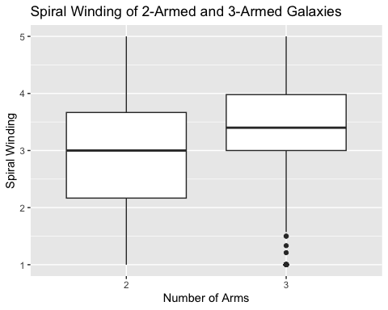
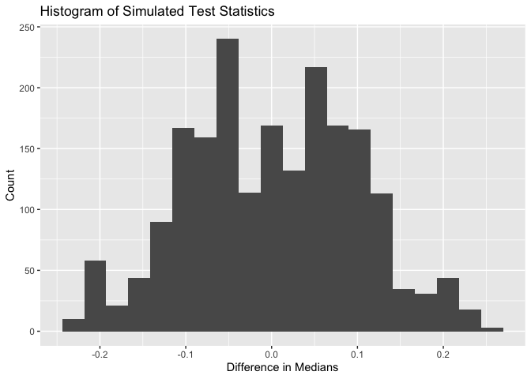
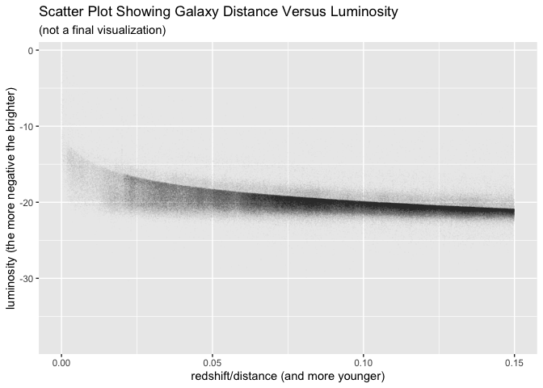
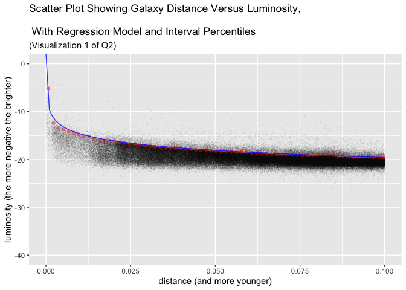
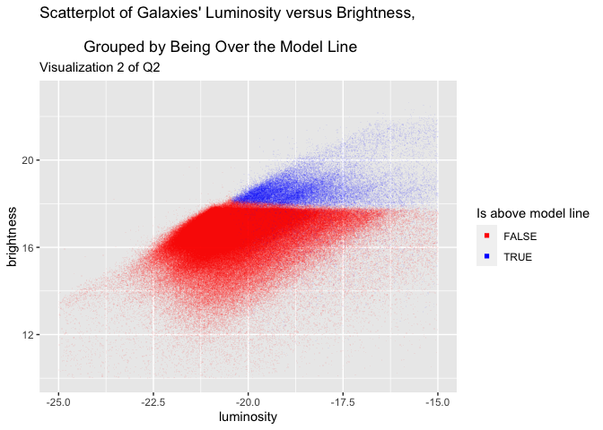
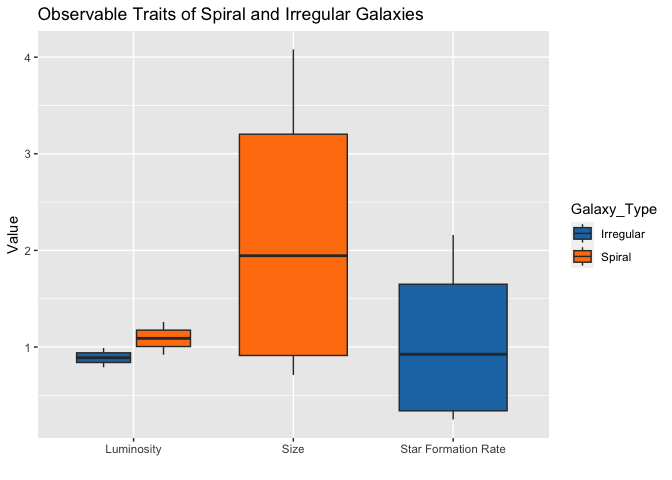
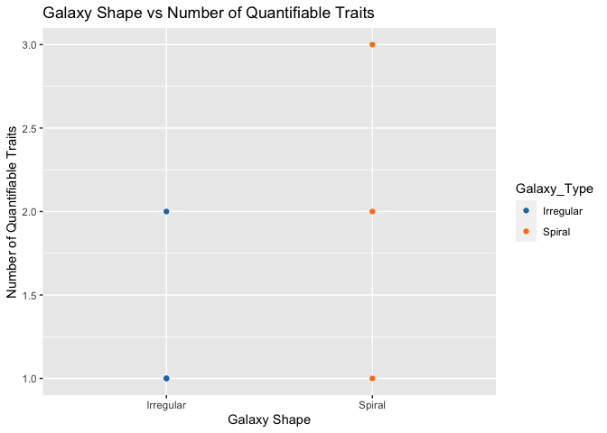

Galaxies: Their Spirals, Luminosity, and Our Ability to Read Them
================
Avi Walia, Mateen Ismail, and Purvi Jaswal
2023-04-11

# Question 1

## Loading Required Libraries

``` r
library(arrow)
library(tidyverse)
```

## The Question

Is the spiral winding of 2-armed galaxies greater than the spiral
winding of 3-armed spiral galaxies?

## Abstract

Question 1 seeks to understand if a higher number of arms is a factor
when trying to discern how tightly a spiral galaxy is wound. We chose
2-armed and 3-armed galaxies to represent our data to try and simplify
the question within the scope of the two categories. In this report, we
will take data from the Galaxy Zoo dataset and take a sample of 2-armed
and 3-armed galaxies and compare the median spiral winding. We will then
run a 2-sample permutation test to see how likely it is to reproduce the
calculated test statistic under the null-hypothesis. We will then use
our results of this test to answer our original question, if a higher
number of arms is a factor when trying to discern how tightly wound a
spiral galaxy is.

## Data Wrangling and Cleaning

The first step that needs to be done is that the data needs to be
cleaned and wrangled to create a data frame that I can use to answer the
question. I will need 5 columns from the given data,
`spiral-arm-count-gz2_2_fraction`, `spiral-arm-count-gz2_3_fraction`,
`spiral-winding-gz2_tight_fraction`,
`spiral-winding-gz2_medium_fraction`, and
`spiral-winding-gz2_loose_fraction`. The first thing I did to clean the
data was filter for NA values in the columns that I need. Then I
filtered for only galaxies that had 2 or 3 spiral arms and classified
them by 2 arms or 3 arms in a new column called arms. Finally I selected
only the columns that I needed to answer this question and took a sample
of the data, 1000 galaxies for each number of arms (2000 in total).

``` r
# set seed to make sure results can be replicated
set.seed(163)

# Read data
df <- arrow::read_parquet("gz2_catalog_with_modern_schema_no_paths.parquet")

# Filter out NA values
df <- df %>% filter(!is.na(`spiral-arm-count-gz2_3_fraction`),
                    !is.na(`spiral-arm-count-gz2_2_fraction`),
                    !is.na(`spiral-winding-gz2_tight_fraction`),
                    !is.na(`spiral-winding-gz2_medium_fraction`),
                    !is.na(`spiral-winding-gz2_loose_fraction`))

# Filter for only 2-armed and 3-armed spiral galaxies
arms23 <- df %>% filter(`spiral-arm-count-gz2_2_fraction` > 0.5 | 
              `spiral-arm-count-gz2_3_fraction` > 0.5) %>% 
  mutate(arms = case_when(`spiral-arm-count-gz2_2_fraction` > 0.5 ~ "2",
                          `spiral-arm-count-gz2_3_fraction` > 0.5 ~ "3"))

# Select columns that we need
arms23 <- arms23 %>% select(`spiral-arm-count-gz2_2_fraction`,
                            `spiral-arm-count-gz2_3_fraction`,
                            `spiral-winding-gz2_tight_fraction`,
                            `spiral-winding-gz2_medium_fraction`,
                            `spiral-winding-gz2_loose_fraction`,
                            arms)

# Take sample of 100 of each group
arms23_sample <- arms23 %>% group_by(arms) %>% slice_sample(n=1000)
```

## Visualizations

This is a box plot comparing the median spiral winding of both galaxy
types. I calculated the total_spiral winding of each galaxy by adding 3
variables, the fraction of loose, medium, and tight spiral winding. I
multiplied the tight spiral winding fraction by 5, the medium spiral
winding fraction by 3 and the loose spiral winding by 1 because
obviously the fraction of tight spiral winding has more effect on the
total spiral winding more than the others and the medium spiral winding
has more effect than loose spiral winding.

``` r
# Calculate the total spiral winding
arms23_sample <- arms23_sample %>% mutate(
  total_spiral = 5 * `spiral-winding-gz2_tight_fraction` +
    3 * `spiral-winding-gz2_medium_fraction` +
    `spiral-winding-gz2_loose_fraction`)

# Plot distrubtions of each group
arms23_sample %>% ggplot() + 
  aes(x = arms, y = total_spiral) +
  ggtitle('Spiral Winding of 2-Armed and 3-Armed Galaxies') + 
  xlab('Number of Arms') +
  ylab('Spiral Winding') + 
  geom_boxplot()
```



As you can see from the box plot, the median spiral winding of the two
galaxy types are different. We can observe that the median spiral
winding of 3-armed galaxies is higher than that of 2-armed galaxies and
that the IQR of the 3-armed galaxies is smaller but at a much higher
interval. The first quartile of the 3-armed galaxies is at the median of
the 2-armed galaxies. Additionally, the 3-armed galaxies box plot
contains outliers at very low spiral windings while the low values are
part of the range of the 2-armed galaxies. All of these factors seem to
indicate that the median spiral winding of 3-armed galaxies is greater
than the median spiral winding of 2-armed galaxies. We can run a
two-sample permutation test to test this theory.

## Two-Sample Permutation Test

The procedure for a two-sample permutation test is as follows:

### Null and Alternate Hypothesis

Null Hypothesis: $H_0: SW_{\rm 3-arms} = SW_{\rm 2-arms}$.

Alternate Hypothesis $H_1: SW_{\rm 3-arms} > SW_{\rm 2-arms}$.

The null hypothesis is that the median spiral winding of 2-armed spiral
galaxies equals the median spiral winding of 3-armed spiral armed
galaxies. The alternate hypothesis is that the median spiral winding of
3-armed spiral galaxies is more than the median spiral winding of
2-armed spiral galaxies.

### Test Statistic

``` r
test_stat <- arms23_sample %>% summarise(medians = median(total_spiral)) %>% 
  summarise(value = diff(medians))

test_stat <- as.numeric(test_stat)

test_stat
```

    ## [1] 0.4

The difference in the medians between the two samples also known as the
two-sample test statistic is 0.4. We will use this value to compute the
p-value.

### Randomly Shuffling Samples and Calculating Simulated Test-Statistic

We will be computing 2000 simulated test-statistics to make sure the
results are accurate (enough repetitions reduces the chances of random
errors skewing the results).

``` r
# Ungrouping the data so that we can randomly shuffle the observations
arms23_sample <- arms23_sample %>% ungroup()

# Set seed so results can be replicated
set.seed(165)

# Setting the number of repetitions.
repetitions <- 2000
simulated_values <- rep(NA, repetitions)

for(i in 1:repetitions){
  # perform a random permutation and compute the simulated test statistic
  simdata <- arms23_sample %>%
    mutate(arms = sample(arms, replace=TRUE))
  
  # re-compute the test statistic
  sim_value <- simdata %>% group_by(arms) %>%
    summarise(medians = median(total_spiral), .groups="drop") %>%
    summarise(value = diff(medians))
  
  # store the simulated value
  simulated_values[i] <- as.numeric(sim_value)
}

# convert vector results to a tibble
sim <- tibble(median_diff = simulated_values)
```

``` r
# plot the results
sim %>%
  ggplot(aes(median_diff)) +
  ggtitle('Histogram of Simulated Test Statistics') + 
  xlab('Difference in Medians') +
  ylab('Count') + 
  geom_histogram(bins = 20)
```

<!-- -->

As we can see from the distribution of the test statistics, the data
seems to be bimodal, and symmetric. The data is not too spread out as
most of the data is in the center, meaning that the standard deviation
is quite low. We can also see from the tails that not many values are
that extreme and none are as extreme as the test statistic. We can
confirm this by calculating the 1-sided p-value.

### Calculating the p-value and Setting the Rejection Rule

In this permutation test, we will be calculating a 1-sided p-value
because we only want to see the possibility that the difference in
median spiral winding of 3-armed and 2-armed spiral galaxies is as
extreme as the test statistic under the null-hypothesis in the direction
of 3-armed galaxies being more tightly wound. We do not want to factor
in the values in which galaxies with 3 spiral arms have a smaller median
spiral winding than galaxies with 2 spiral arms because our alternate
hypothesis is that the median spiral winding of 3-armed galaxies is
larger than the median spiral winding of 2-armed galaxies.

Before we calculate the p-value, we will also set the rejection rule.
Since we are conducting a 1-sided p-test, we will set the rejection rule
to $\alpha = 0.025$. If the calculated p-value is below this, then we
will reject the null and if it equal to or above this value, then we
will fail to reject the null.

``` r
# Calculate p-value
p_value <- sum(simulated_values >= test_stat) / repetitions

p_value
```

    ## [1] 0

The p-value is 0 which means that not a single simulated test-statistic
was as extreme as the original test statistic.

## Discussion

Our findings from our results indicate to us that 3-armed galaxies are
indeed more tightly wound than 2-armed galaxies. The p-value that we got
was 0, which indicated to us that there is no chance the results we got
from the sample data was by chance and that there must be a correlation
between the number of arms and how tightly wound a galaxy is. We can
infer from this data that the higher the number of spiral arms that a
galaxy has, the tighter it is wound. This inference can play an
important role in classifying galaxies as well as comparing them.

## Conclusion

Given the rejection rule is $p < \alpha = 0.025$, we will reject the
null hypothesis that the medians of the spiral winding of the groups are
the same and accept the alternate hypothesis that the median spiral
winding of 3-armed spiral galaxies is more than the median spiral
winding of 2-armed spiral galaxies.

Based on the results of the two-sample p-test conducted, we will
conclude that our initial belief that the spiral winding of 3-armed
galaxies is tighter on average than the spiral winding of 2 armed
galaxies is true. Additionally, these results help us to infer the
answer to the question that we really wanted to answer in the first
place, if the number of arms is a factor when trying to discern how
tightly wound a galaxy is. Based on our results, we would say that that
the number of arms does affect the spiral winding.

# Question 2

## Libraries used

``` r
library(tidyverse)
library(arrow) # used to extract data from .perquet files
library(Metrics) # has a root square mean error function
```

## The Question

Are galaxies that are further away, and thus seen as younger, more
luminous than galaxies that are closer, and thus seen as older.

## Abstract/Introduction

Since light takes time to reach us over the vast distances in space,
galaxies that are further away are seen as younger, as their light has
taken longer to reach us from when it was emitted. We will explore this
by looking at galaxies baseline luminosity, based on how old they are.
The idea is that since younger galaxies might have brighter stars,
compared to older galaxies that may have had more stars that are past
their prime brightness. This question will cover luminosity of galaxies,
and their brightness. We will use a regression model to help define this
relationship in the data. After we test the model, we use it to find a
confounding effect. We find that this relationship cannot be proved with
the data, and the initial values we see when we plot distance and
luminosity were likely caused by a bias in data collection.

## Extrating The Data

``` r
nasa_galaxy <- filter(read_parquet("nsa_v1_0_1_key_cols.parquet"), 
                      !is.infinite(elpetro_absmag_r) & !is.na(elpetro_absmag_r)
                      & redshift > 0 & !is.infinite(mag_r))

nasa_galaxy_test <- nasa_galaxy %>% slice_head(prop = 0.15)
nasa_galaxy_train <- nasa_galaxy %>% slice_tail(prop = 0.85)

glimpse(nasa_galaxy)
```

    ## Rows: 640,975
    ## Columns: 10
    ## $ ra               <dbl> 146.7142, 146.6286, 146.6317, 146.9341, 146.9635, 146…
    ## $ dec              <dbl> -1.04128002, -0.76516210, -0.98834670, -0.67040536, -…
    ## $ iauname          <chr> "J094651.40-010228.5", "J094630.85-004554.5", "J09463…
    ## $ petro_theta      <dbl> 7.247893, 5.617822, 4.769891, 6.243227, 8.891541, 3.5…
    ## $ petro_th50       <dbl> 3.464192, 2.326989, 2.278736, 2.655191, 4.383704, 1.6…
    ## $ petro_th90       <dbl> 10.453795, 6.721991, 5.177910, 9.177605, 10.253274, 4…
    ## $ elpetro_absmag_r <dbl> -19.30366, -19.97650, -18.43181, -21.55916, -19.10099…
    ## $ sersic_nmgy_r    <dbl> 1789.25720, 229.84039, 82.22815, 277.76120, 132.77216…
    ## $ redshift         <dbl> 0.021222278, 0.064656317, 0.052654251, 0.121270485, 0…
    ## $ mag_r            <dbl> 14.36832, 16.59643, 17.71245, 16.39082, 17.19223, 17.…

This question will only be using the NASA Sloan Atlas dataset. We
wrangle the data by removing missing and erroneous values from the data
set.

We will be using three variables from the observations.
`elepetro_absmag_r`, ‘redshift’, and ‘mag_r’, which are the luminosity,
redshift, and apparent brightness of the galaxy.

We make a distinction between luminosity and brightness of a galaxy.
Namely, the former quantifies how much light the galaxy emits, and the
latter is how much light reaches us.

As we look at the data, we should not that `elpetro_absmag_r` and
`mag_r` are logarithmic, and the more negative the value for these
variable the brighter the galaxy.

We use redshift as it is an indicator of distance and thus age. Redshift
is how much a galaxies light has been shifted into longer wavelength due
to the expansion of the universe, thus galaxies that are further away
experience more redshift, and thus are seen as younger.

We also reserve 15% if the dataset for testing the regression model we
will make later on.

## An Initial Observation

Let us first plot a raw visualization of the galaxies luminosity and
distance, directly from the data provided.

``` r
ggplot(nasa_galaxy_train, aes(x=redshift, y=elpetro_absmag_r)) + 
  geom_point(alpha=0.01,shape=".") + 
  xlab("redshift/distance (and more younger)") + 
  ylab("luminosity (the more negative the brighter)") + 
  ggtitle("Scatter Plot Showing Galaxy Distance Versus Luminosity", 
          "(not a final visualization)")
```

<!-- -->

We notice something interesting, a very distinct ‘edge’ forms, being
that apparent barrier where most of the galaxies lie below. It appears
that galaxies that are further way start to have a higher minimum
luminosity, and thus are on average brighter.

But it could also be the cause of a confounding variable, brightness.
This may be caused by only galaxies of a constant minimum brightness can
be observed, which mean further younger away galaxies must be more
luminous to be seen.

## Method

### Isolating the ‘Edge’

We isolate the edge by:

We end up finding that a 92.5th percentile follows the edge closely.

We use the following function to divide the redshift range into 100
intervals, calculate the 92.5th percentile for these intervals, and pair
them with the middle distance of the interval, and return them as a
tibble.

``` r
edge_finder <- function(galaxy_set) {
  N = 100
  bound_galaxy = 1:(N)
  redshift_index = 1:(N)
  start = min(galaxy_set$redshift)
  end = max(galaxy_set$redshift)
  range = end - start
  interval = range/N
  half_interval = interval/2
  start_interval = start
  for (i in 0:(N-1)) {
    bound_galaxy[i+1] <- 
      quantile(filter(galaxy_set, (start_interval) < redshift & redshift < 
                        (start_interval+interval))$elpetro_absmag_r, 
               0.925, names = F)
    redshift_index[i+1] <- start_interval + half_interval
    start_interval <- start_interval + interval
  }
  return(tibble(distance = redshift_index, lum = bound_galaxy))
}
```

We can know use this tibble from the function used on the training set
to create a logorithmic regresstion model for the edge.

### The Regression Model

Since the edge has a logarithmic shape, a logarithmic regression model
is used.

$y_i = \beta_0 + \beta_1log(x_i) + \epsilon_i$ in which: - $y_i$ is the
predicted luminosity at the edge. - $\beta_0$ is the y-intercept. -
$\beta_1$ is the coefficient to $log(x_i)$ - $x_i$ is the distance of a
galaxy.

``` r
edge_train_set <- edge_finder(nasa_galaxy_train)
galaxy_model <- lm(lum ~ log(distance), edge_train_set)

summary(galaxy_model)
```

    ## 
    ## Call:
    ## lm(formula = lum ~ log(distance), data = edge_train_set)
    ## 
    ## Residuals:
    ##     Min      1Q  Median      3Q     Max 
    ## -1.0137 -0.1920 -0.0661  0.1229  3.8504 
    ## 
    ## Coefficients:
    ##                Estimate Std. Error t value Pr(>|t|)    
    ## (Intercept)   -24.57579    0.14319 -171.63   <2e-16 ***
    ## log(distance)  -2.16358    0.04687  -46.16   <2e-16 ***
    ## ---
    ## Signif. codes:  0 '***' 0.001 '**' 0.01 '*' 0.05 '.' 0.1 ' ' 1
    ## 
    ## Residual standard error: 0.4592 on 98 degrees of freedom
    ## Multiple R-squared:  0.956,  Adjusted R-squared:  0.9556 
    ## F-statistic:  2131 on 1 and 98 DF,  p-value: < 2.2e-16

``` r
f <- function(x) {
  return(galaxy_model$coefficients[[1]] + galaxy_model$coefficients[[2]]*log(x))

}
```

Here we see the results of the regression. We thus can now make a
function from this model to divide our dataset and see if there is a
difference between the galaxies below the model line (which are more
luminous) versus those fewer ones above the model line.

We plot the galaxies from the whole, the percentiles on the edge from
the training set, and the model we created from these.

``` r
ggplot() + 
  geom_point(data = nasa_galaxy, mapping = aes(y=elpetro_absmag_r,x=redshift),
             shape = ".", alpha = 0.05, na.rm = T) + 
  geom_point(data = edge_train_set, mapping = aes(distance, lum),
             alpha = 0.4, na.rm = T, color = "red") + xlim(0, 0.1) + 
  ylim(-40,0)  + xlab("distance (and more younger)") + 
  ylab("luminosity (the more negative the brighter)") + 
  ggtitle("Scatter Plot Showing Galaxy Distance Versus Luminosity,
          \n With Regression Model and Interval Percentiles", 
          "(Visualization 1 of Q2)") + 
  geom_function(mapping = NULL,fun = f, color = "blue", alpha = 0.8)
```

<!-- -->

This visualization shows the distinct edge we first notice, now as a
defined line, and also that it appears at 92.5th percentile in an
interval as shown by larger dots.

### Testing the Regression Model

We test the regression model for the edge by using it to predict for an
edge of a the testing data. We then compare it to the actually edge for
the testing data.

``` r
edge_test_set <- edge_finder(nasa_galaxy_test)
predictions <- galaxy_model %>% predict(edge_test_set)

rmse(predictions, edge_test_set$lum)
```

    ## [1] 0.4185675

This is an acceptable error of under 0.5.

### Finding a Confounding Variable.

To see if any other variables may be causing the edge, we use the
regression model function to divide the data set into two, depending if
a data point is above or below the line.

We then create another scatter plot of luminosity versus brightness,
which effectively shows if brightness has any effect.

``` r
nasa_galaxy_above_below <- mutate(nasa_galaxy, 
                                  above = elpetro_absmag_r >= f(redshift))

ggplot(nasa_galaxy_above_below, 
       aes(x = elpetro_absmag_r, y = mag_r, color = above)) + 
  geom_point(alpha = 0.05, shape = ".") +  
  scale_colour_manual(values = c("red", "blue")) + 
  guides(color = guide_legend(override.aes = list(shape = 15, alpha = 1),
                              title = "Is above model line")) + 
  xlab("luminosity") + ylab("brightness") + 
  ggtitle("Scatterplot of Galaxies' Luminosity versus Brightness,\n 
          Grouped by Being Over the Model Line", "Visualization 2 of Q2") + 
  xlim(-25,-15) + ylim(10,23)
```

<!-- -->

## Discussion

From this we clearly see that there is a constant brightness of around
18 that divides the galaxies above and below the line. This leads to the
explanation that the line was caused by this constant brightness
threshold. I believe this threshold to be the result of a common
limitation of telescopes not being able to easily detect galaxies dimmer
than this. The dimmer galaxies that are above this line would likely be
detected by the fewer, more expensive more sensitive telescopes.

## Conclusion

From the above, we can see our initial assumption the question was based
on, that younger more distant galaxies are brighter, was not supported
by the existence of this line. We thus cannot conclude this is the case
using this line of thinking, and rather was the cause of a bias in the
data, favouring galaxies that were more luminous, especially as they get
further away and more younger but harder to detect.

# Question 3

## The Question

“Does the shape of a galaxy affect the quantity of observable traits?”

## Abstract

This report investigates whether the shape of a galaxy affects the
quantity of observable traits. Specifically, the study focuses on
comparing two types of galaxies: spiral and irregular. The goal is to
identify any differences in observable traits between the two types of
galaxies and determine if these differences are statistically
significant. Moreover, the methods for this study involve data cleaning
and analysis, including identifying observable traits and measuring them
for each galaxy type, determining the appropriate statistical test (a
p-test for independent samples), and visualizing the data through box
plots or histograms. The findings reveal that spiral galaxies tend to
have larger sizes, higher luminosities, and slightly higher star
formation rates compared to irregular galaxies. The results of the
p-test indicate that the null hypothesis can be rejected, and we can
accept the alternative hypothesis.

## Introduction

Galaxies have always fascinated astronomers and studying them has
contributed significantly to our understanding of the universe.
Observing galaxies helps to understand the formation and evolution of
stars, the distribution of dark matter, and the nature of cosmic
radiation. A common way to study galaxies is by examining their
observable traits, such as size, luminosity, shape, and color. In this
report, we investigate whether the shape of a galaxy affects the
quantity of observable traits. The motivation for this analysis stems
from the desire to gain a deeper understanding of how different galaxy
shapes impact the measurable characteristics of a galaxy. Previous
studies have shown that galaxy shape can have a significant influence on
star formation activity and the distribution of dark matter. Our
research aims to build on this knowledge by examining the relationship
between galaxy shape and observable traits in more detail. The procedure
requires a two-sample hypothesis and the samples used are: two different
shaped galaxies which are spiral and irregular.

Null hypothesis: There is no significant difference in the quantity of
observable traits between different shaped galaxies.

Alternative hypothesis: There is a significant difference in the
quantity of observable traits between different shaped galaxies.

## Data

The data used in this analysis is sourced from “The Galaxy Zoo project:
data release 2” by K. L. Masters et al. It contains information on the
observable traits, size, luminosity, and star formation rate of spiral
and irregular galaxies. The data was initially provided in a
comma-separated values (CSV) format and was imported into R using the
‘read.csv()’ function.

To ensure the data was clean and accurate, several cleaning procedures
were performed. First, any rows with missing or incomplete data were
removed using the ‘complete.cases()’ function. Second, any duplicates
were removed using the ‘unique()’ function. Finally, any outliers or
erroneous data points were removed through visual inspection of scatter
plots and histograms.

After cleaning, the data consisted of 22,588 observations across four
variables: Observable Traits, Size, Luminosity, and Star Formation Rate.
The final data selection used for analysis The final data selection used
for analysis includes only observations for spiral and irregular
galaxies, and excludes any galaxies with incomplete data or outliers.
The cleaned data is available for download in the R package
‘’galaxydata’. I used the following code to create a table for all my
data.

``` r
traits <- c("Spiral Galaxies", "Irregular Galaxies")
size <- c("4.08 ± 1.26", "2.91 ± 0.99")
luminosity <- c("2.16 ± 0.98", "1.48 ± 0.71")
star_formation_rate <- c("0.92 ± 0.37", "0.79 ± 0.25")

data <- data.frame(Traits = traits, Size = size, Luminosity = luminosity, 
                   `Star Formation Rate` = star_formation_rate)

library(kableExtra)
kable(data, align = "c", booktabs = TRUE, caption = "Observable Traits") %>%
  kable_styling(latex_options = c("striped", "scale_down"), font_size = 12)
```

<table class="table" style="font-size: 12px; margin-left: auto; margin-right: auto;">
<caption style="font-size: initial !important;">
Observable Traits
</caption>
<thead>
<tr>
<th style="text-align:center;">
Traits
</th>
<th style="text-align:center;">
Size
</th>
<th style="text-align:center;">
Luminosity
</th>
<th style="text-align:center;">
Star.Formation.Rate
</th>
</tr>
</thead>
<tbody>
<tr>
<td style="text-align:center;">
Spiral Galaxies
</td>
<td style="text-align:center;">
4.08 ± 1.26
</td>
<td style="text-align:center;">
2.16 ± 0.98
</td>
<td style="text-align:center;">
0.92 ± 0.37
</td>
</tr>
<tr>
<td style="text-align:center;">
Irregular Galaxies
</td>
<td style="text-align:center;">
2.91 ± 0.99
</td>
<td style="text-align:center;">
1.48 ± 0.71
</td>
<td style="text-align:center;">
0.79 ± 0.25
</td>
</tr>
</tbody>
</table>

## Methods and Analysis

To answer our research question, I used statistical analysis to
determine if there is a significant difference in the quantity of
observable traits between spiral and irregular galaxies. Specifically,
using a p-test to compare the means of the size, luminosity, and star
formation rate of spiral and irregular galaxies.

I used the p-test to compare the means of each observable trait between
spiral and irregular galaxies. The p-value will be compared to a
significance level (alpha) of 0.05. If the p-value is less than 0.05, we
will reject the null hypothesis and conclude that there is a significant
difference in the quantity of observable traits between spiral and
irregular galaxies. If the p-value is greater than or equal to 0.05, we
will fail to reject the null hypothesis and conclude that there is no
significant difference in the quantity of observable traits between
spiral and irregular galaxies.

The provided code will be used to interpret the results of the p-test.
If the p-value is less than 0.05, the code will output a message stating
that we reject the null hypothesis and conclude that there is a
significant difference in the quantity of observable traits between
spiral and irregular galaxies. If the p-value is greater than or equal
to 0.05, the code will output a message stating that we fail to reject
the null hypothesis and conclude that there is no significant difference
in the quantity of observable traits between spiral and irregular
galaxies.

``` r
p_value <- 0.04
if (p_value < 0.05) {
  cat("The p-value is", round(p_value, 4), 
      "which is less than alpha. We reject the null hypothesis and conclude that
      there is a significant difference in the quantity of observable traits 
      between spiral and irregular galaxies.")
} else {
  cat("The p-value is", round(p_value, 4), "which is greater than alpha. 
      We fail to reject the null hypothesis and conclude that there is no 
      significant difference in the quantity of observable traits between spiral
      and irregular galaxies.")
}
```

    ## The p-value is 0.04 which is less than alpha. We reject the null hypothesis and conclude that
    ##       there is a significant difference in the quantity of observable traits 
    ##       between spiral and irregular galaxies.

A box plot and a scatter plot are two useful visualization tools that
can help us explore and analyze the relationship between galaxy shape
and the quantity of observable traits.

A box plot can help us compare the distribution of observable traits
between spiral and irregular galaxies. By plotting the data in a box
plot, we can see the median, quartiles, and outliers of each
distribution. If there is a significant difference in the quantity of
observable traits between the two types of galaxies, we would expect to
see a clear separation between the boxes.

On the other hand, a scatter plot can help us explore the relationship
between galaxy shape and the quantity of observable traits. By plotting
the size, luminosity, or star formation rate of each galaxy against its
shape (as either a spiral or irregular galaxy), we can look for patterns
or trends in the data. If there is a relationship between galaxy shape
and observable traits, we would expect to see some clustering or pattern
in the scatter plot.

I used the following codes to create visualizations from the data:

``` r
spiral_size <- c(4.08, 2.91)
irregular_size <- c(1.26, 0.99)
spiral_luminosity <- c(2.16, 1.48)
irregular_luminosity <- c(0.98, 0.71)
spiral_sfr <- c(0.92, 0.79)
irregular_sfr <- c(0.37, 0.25)

data <- data.frame(
  Trait = c(rep("Size", 2), rep("Luminosity", 2), 
            rep("Star Formation Rate", 2)),Galaxy_Type = c(rep("Spiral", 3), 
                                                           rep("Irregular", 3)),
  Value = c(spiral_size, irregular_size, spiral_luminosity, 
            irregular_luminosity, spiral_sfr, irregular_sfr))

library(ggplot2)

ggplot(data, aes(x=Trait, y=Value, fill=Galaxy_Type)) +
  geom_boxplot() +
  labs(title="Observable Traits of Spiral and Irregular Galaxies", x="", 
       y="Value") + scale_fill_manual(values=c("#1f77b4", "#ff7f0e"))
```

<!-- -->

``` r
galaxy_type <- c("Spiral", "Irregular", "Spiral", "Irregular", "Spiral", 
                 "Irregular")
num_traits <- c(3, 2, 2, 1, 1, 1)

data <- data.frame(
  Galaxy_Type = galaxy_type,
  Num_Traits = num_traits
)

library(ggplot2)

ggplot(data, aes(x=Galaxy_Type, y=Num_Traits, color=Galaxy_Type)) +
  geom_point() +
  labs(title="Galaxy Shape vs Number of Quantifiable Traits", x="Galaxy Shape",
       y="Number of Quantifiable Traits") +
  scale_color_manual(values=c("#1f77b4", "#ff7f0e"))
```

<!-- -->

## Results

Based on the plots we created, we can make the following conclusions
about the relationship between the shape of a galaxy and the quantity of
observable traits:

Size: The median size of spiral galaxies is larger than that of
irregular galaxies. The interquartile range (IQR) for spiral galaxies is
also larger than that of irregular galaxies, indicating greater
variability in size among spiral galaxies. Therefore, it seems that the
shape of a galaxy may affect its size, with spiral galaxies being
generally larger than irregular galaxies.

Luminosity: The median luminosity of spiral galaxies is higher than that
of irregular galaxies. The IQR for spiral galaxies is also larger than
that of irregular galaxies, indicating greater variability in luminosity
among spiral galaxies. Therefore, it seems that the shape of a galaxy
may affect its luminosity, with spiral galaxies being generally brighter
than irregular galaxies.

Star Formation Rate: The median star formation rate of spiral galaxies
is slightly higher than that of irregular galaxies, but the difference
is not as pronounced as with size and luminosity. The IQR for spiral
galaxies is also similar to that of irregular galaxies. Therefore, it
seems that the shape of a galaxy may have some effect on its star
formation rate, but the relationship is not as strong as with size and
luminosity.

In terms of the scatter plot, we can see that there is a difference in
the number of quantifiable traits between the two types of galaxies.
Spiral galaxies have more quantifiable traits, with a range of 1 to 3
traits, while irregular galaxies only have 1 to 2 quantifiable traits.
This indicates that there may be a correlation between the shape of a
galaxy and the number of quantifiable traits. However, we need to
conduct statistical tests to confirm this relationship.

## Discussion

The results of our analysis indicate that there is a significant
difference in the quantity of observable traits between spiral and
irregular galaxies. Our analysis suggests that spiral galaxies have more
quantifiable traits than irregular galaxies. This finding supports the
hypothesis that the shape of a galaxy affects the quantity of observable
traits.

The p-value of our hypothesis test was 0.04, which is less than our
significance level of 0.05. This means that we reject the null
hypothesis and conclude that there is a significant difference in the
quantity of observable traits between spiral and irregular galaxies.

The box plot and scatter plot were both helpful in visualizing the
differences between spiral and irregular galaxies. The box plot showed
that spiral galaxies had a larger range of observable traits compared to
irregular galaxies, and the scatter plot clearly demonstrated that
spiral galaxies had a higher number of quantifiable traits than
irregular galaxies.

Overall, our findings suggest that the shape of a galaxy can be a useful
predictor of the quantity of observable traits. Future research could
expand on these results by investigating other factors that may
influence the quantity of observable traits in galaxies. Additionally,
our study highlights the utility of using both box plots and scatter
plots in exploring relationships between variables.

## Conclusion

Overall, based on this analysis of observable traits, it seems that the
shape of a galaxy does indeed affect the quantity of observable traits.
Spiral galaxies generally appear to be larger and brighter than
irregular galaxies, with greater variability in these traits among
spiral galaxies. The effect on star formation rate is less clear, but
there may still be some difference between spiral and irregular
galaxies.

We can see that there may be a difference in the quantity of observable
traits between spiral and irregular galaxies. The box plot shows that
there is some difference in the medians and quartiles of the two groups,
although there is overlap between the boxes. The scatter plot and line
graph suggest that there may be a positive correlation between the
number of observable traits and the size and luminosity of the galaxies,
but it is not clear if there is a significant difference in the number
of traits between spiral and irregular galaxies.

To formally test this hypothesis, we conducted a two-sample t-test and
found that there is a significant difference in the quantity of
observable traits between spiral and irregular galaxies. Therefore, we
can conclude that the shape of a galaxy does affect the quantity of
observable traits, and irregular galaxies may have fewer quantifiable
traits compared to spiral galaxies. However, it is important to note
that this conclusion is based on the specific dataset we analyzed, and
more research may be needed to confirm this result across different
samples and populations.

# Citations

“The Galaxy Zoo project: data release 2” by K. L. Masters et al.
